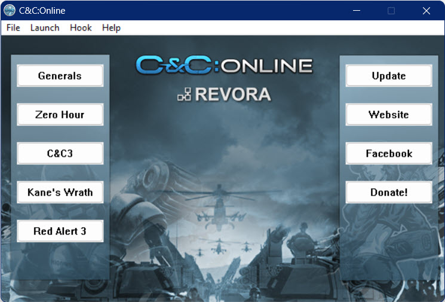
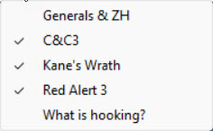
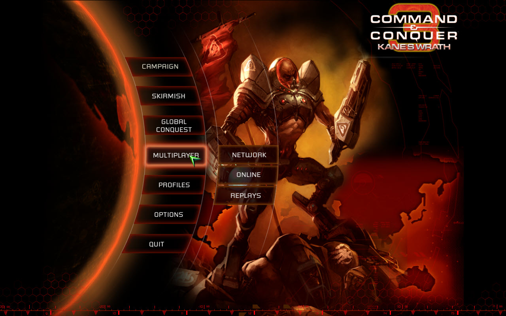
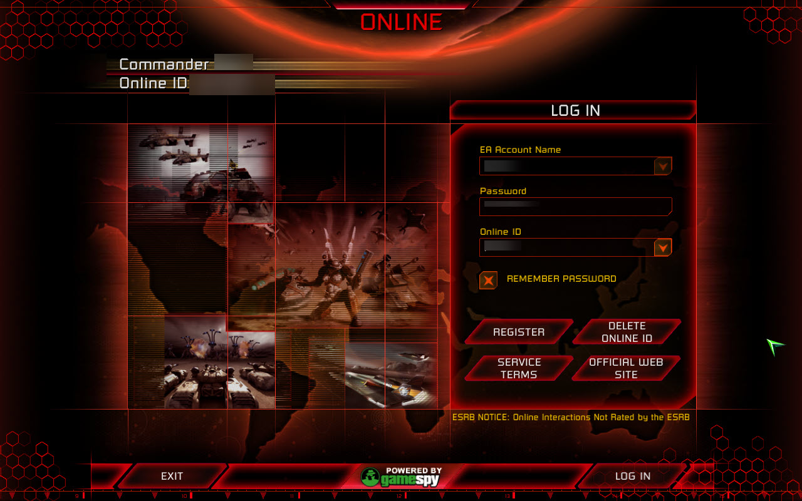
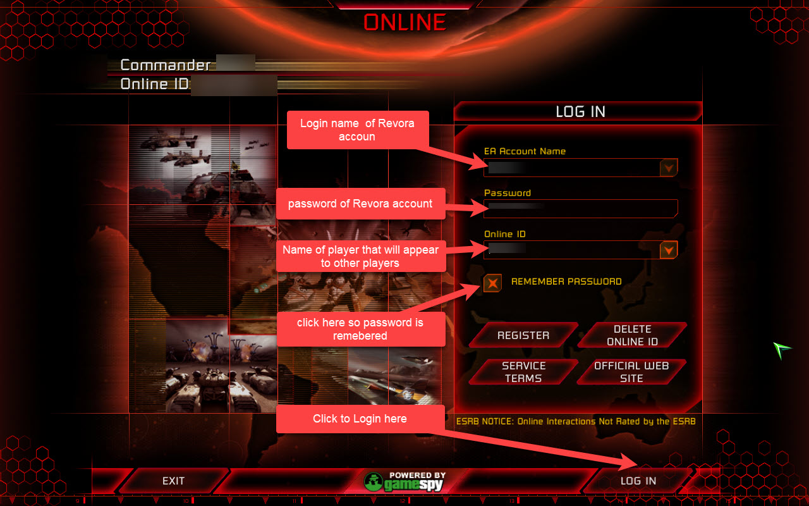
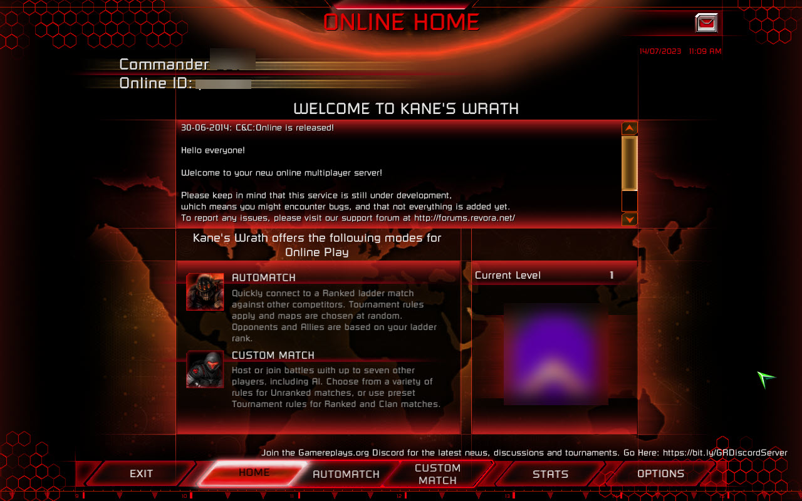

# Introduction
 The command and conquer seris developed by Electronic arts have games that you can have multiplayers but since gamespy servers are no longer available to play online there is a solution. To use cnconline application.
 Here are the instructions for installing and using the app.

 ## Installing
Goto the cncoline website [here](https://cnc-online.net/en/) and register.
Remember the cnconline registration details or copy them to a text file.

Doownload the cnconline app [here](https://cnc-online.net/en/download/)
or from LastOS repo a silent install apz [here](https://www.lastos.org/repo/CNCOnline_v2.0.7_ssApp.apz)

Install the cnconline app,

open the application,

 the main screen will appear as shown in  figure 1

figure 1 cnconline app

Click on the main screen click  the hook option to see the following options as shown in figure 2
click on the game name so that it has a tick next to it.

figure 2 hook options

When the hook option is selected and when the game is started the cnconline app will start and then clicking on the game name it will start the game with cnconline app running in the backgroud this will allow the player to use the login screen ro connect with other players.

## Example
An example Kane's Wrath is selected starting the game.

The main screen will appear as shown in figure 3

figure 3 cnckw main menu

By selecting from the main menu multiplayer-->online the login page as shown in figure 4

figure 4 login

Enter in the details from cnconline registration as shown in figure 5

Server Login Name:
Server Password:

fugure 5

click on log in and this screen will appear as shown in figure 6

figure 6 ONline home

then click on custom match to start playing games with other players.